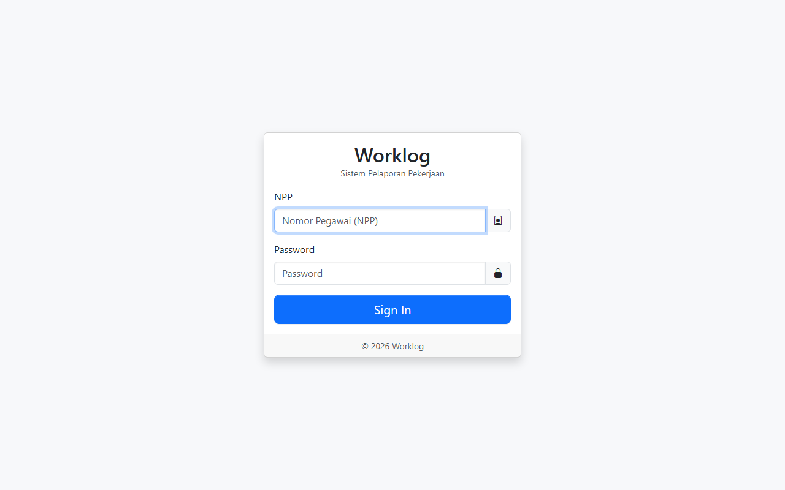

# Worklog

Sistem pelaporan pekerjaan berbasis web untuk perusahaan. Pegawai melihat tugas yang ditugaskan, mengajukan pekerjaan baru, dan menandai pekerjaan selesai. Admin/supervisor memantau progres seluruh tim lewat dashboard statistik dan leaderboard.

## Screenshot



## Key Features

- **Login per pegawai** menggunakan NPP (Nomor Pegawai), password di-hash (`password_hash`), dengan fallback plaintext untuk data lama
- **Dashboard** — jumlah pekerjaan aktif & selesai, pekerjaan berdeadline 7 hari ke depan, 5 pekerjaan terbaru
- **Leaderboard** — peringkat pegawai berdasar total tugas dan tugas selesai
- **Daftar Pekerjaan** — form pembuatan pekerjaan dengan penugasan ke pegawai, kalender FullCalendar untuk timeline pekerjaan
- **Mark done** — penandai pekerjaan selesai via API
- **Role-based** — role `user` hanya melihat pekerjaan yang ditugaskan ke dirinya; role lain (admin/supervisi) melihat semua

## Tech Stack

| Komponen    | Teknologi                                       |
| ----------- | ----------------------------------------------- |
| Language    | PHP 8.x                                         |
| Database    | MySQL / MariaDB (mysqli, prepared statements)   |
| UI          | AdminLTE (Bootstrap 5), Bootstrap Icons         |
| Interaksi   | jQuery, FullCalendar, SweetAlert2               |
| Server      | PHP built-in server (dev) / Apache+PHP (prod)   |
| Deployment  | Hosting shared cPanel (DB `u9621710_worklog`)   |

## Prerequisites

- PHP 8.0+ dengan ekstensi `mysqli` dan `pdo_mysql` (opsional)
- MySQL 5.7+ / MariaDB 10+
- Web browser modern

## Getting Started

### 1. Clone repository

```bash
git clone https://github.com/candzon/worklog.git
cd worklog
```

### 2. Buat database

```sql
CREATE DATABASE u9621710_worklog CHARACTER SET utf8mb4;
USE u9621710_worklog;

CREATE TABLE employee (
  id INT PRIMARY KEY AUTO_INCREMENT,
  npp VARCHAR(50) NOT NULL,
  password VARCHAR(255) NOT NULL,
  nama_emp VARCHAR(100) NOT NULL,
  nama_bagian VARCHAR(100),
  role_id INT
);

CREATE TABLE roles (
  id INT PRIMARY KEY AUTO_INCREMENT,
  name VARCHAR(50) NOT NULL
);

CREATE TABLE pekerjaan (
  id INT PRIMARY KEY AUTO_INCREMENT,
  judul VARCHAR(255) NOT NULL,
  deskripsi TEXT,
  npp VARCHAR(50) NOT NULL,
  nama_emp VARCHAR(100),
  tgl_mulai DATE NULL,
  tgl_selesai DATE NULL,
  ditugaskan VARCHAR(50),
  status VARCHAR(20) DEFAULT 'open',
  created_at DATETIME DEFAULT CURRENT_TIMESTAMP
);
```

Contoh seed role + pegawai (password `secret123`, auto-hash saat login pertama tidak dilakukan — hash manual):

```sql
INSERT INTO roles (name) VALUES ('admin'), ('user');
INSERT INTO employee (npp, password, nama_emp, nama_bagian, role_id)
VALUES ('100001', '$2y$10$...')
```

Untuk generate hash password:

```bash
php -r "echo password_hash('admin123', PASSWORD_DEFAULT), PHP_EOL;"
```

### 3. Konfigurasi koneksi DB

Edit `config/database.php`:

```php
$config = [
    'host' => '127.0.0.1',
    'dbname' => 'u9621710_worklog',
    'user' => 'root',
    'pass' => '',
    'charset' => 'utf8mb4',
];
```

Sesuaikan `user`, `pass`, dan `dbname` dengan environment lokal. **Jangan commit kredensial produksi.**

### 4. Jalankan server development

```bash
php -S localhost:8888
```

Buka [http://localhost:8888/login.php](http://localhost:8888/login.php).

Untuk Apache (produksi), letakkan folder di document root; `.htaccess` sudah tersedia.

## Architecture

### Directory Structure

```
worklog/
├── api/
│   ├── create_pekerjaan.php    # API AJAX create pekerjaan ( AJAX AJAX )
│   ├── events_pekerjaan.php    # Feed event untuk FullCalendar (JSON)
│   └── mark_done.php           # API tandai pekerjaan selesai
├── assets/
│   ├── css/                    # AdminLTE, style kustom
│   ├── img/                    # logo.png
│   └── js/                     # AdminLTE, script kustom
├── config/
│   └── database.php            # Koneksi mysqli (username/password di file ini)
├── functions/
│   └── helpers.php             # Helper: session (set_user_npp / clear_user_session), flash SweetAlert...
├── includes/
│   ├── header.php              # Layout atas head html ( html/html ) - navbar dsb
├── daftar_pekerjaan.php        # CRUD list + form tambah pekerjaan
├── index.php                   # Dashboard (stat + leaderboard + list terbaru)
├── login.php                   # Form login (NPP + password)
├── logout.php                  # Hapus session, redirect login
└── .htaccess                   # Aturan server (rewrite / deny)
```

### Request Lifecycle

1. Browser request `login.php` / `index.php` / `daftar_pekerjaan.php`
2. Script `require` helper + `config/database.php` koneksi `$conn` (mysqli)
3. `ensure_session_started()` memastikan session aktif; `$_SESSION['npp']` dipakai untuk identitas
4. Filter data: jika `role_id` user → `pekerjaan.ditugaskan = NPP`, selain itu semua tampil
5. Interaksi AJAX (`api/create_pekerjaan.php`, `api/mark_done.php`) → response JSON → update UI + SweetAlert
6. FullCalendar fetch event ke `api/events_pekerjaan.php`

### Data Flow

```
Browser → PHP Script → mysqli ($conn) → MySQL
       ↖ AJAX (fetch/jQuery) ← JSON Response ←
```

### Database Schema

| Tabel       | Kolom Penting                                                                       | Keterangan                               |
| ----------- | ----------------------------------------------------------------------------------- | ---------------------------------------- |
| `employee`  | `npp` (login ID), `password` (bcrypt), `nama_emp`, `nama_bagian`, `role_id`          | Pegawai                                  |
| `roles`     | `name` (`admin`, `user`)                                                             | Role untuk otorisasi tampilan dashboard  |
| `pekerjaan` | `judul`, `deskripsi`, `npp` (pembuat), `ditugaskan` (NPP penerima), `tgl_mulai/selesai`, `status` (`open`/`done`) | Pekerjaan / tugas |

## Security Notes

- Semua query memakai **prepared statements** (mysqli) → bebas SQL Injection umum
- Output lewat helper `e()` (`htmlspecialchars`) untuk XSS
- `session_regenerate_id(true)` saat login/logout (session fixation)
- `config/database.php` menyimpan kredensial **di source code** — untuk produksi disarankan pindah ke env var / file di luar webroot
- Error koneksi DB tidak menampilkan `connect_error` ke user (`die('Database connection failed.')`)

## Available Scripts

| Command                                   | Keterangan                          |
| ----------------------------------------- | ----------------------------------- |
| `php -S localhost:8888`                   | Dev server dari root project        |
| `php -r "echo password_hash('x',PASSWORD_DEFAULT);"` | Generate bcrypt password seed |
| `mysqldump -u root u9621710_worklog > backup.sql` | Backup database              |

## Troubleshooting

| Gejala                                        | Penyebab                             | Solusi                                  |
| --------------------------------------------- | ------------------------------------ | --------------------------------------- |
| `Database connection failed.`                 | MySQL mati / kredensial salah        | Jalankan MySQL, cek `config/database.php` |
| Login gagal terus padahal NPP benar           | Password belum bcrypt                | Generate hash via `password_hash`, update `employee.password` |
| Halaman kosong / ` Callable undefined`        | Ext `mysqli` tidak aktif             | Aktifkan di `php.ini`: `extension=mysqli` |
| Kalender / leaderboard kosong                 | Tabel `pekerjaan` belum ada / kosong | Buat tabel & seed data                  |
| Port `php -S` gagal `address in use`          | Port sudah dipakai / reserved        | Pakai port lain, contoh `php -S 127.0.0.1:8888` |

## Deployment (shared hosting / cPanel)

1. Upload semua file (kecuali `.git/`, `docs/`) ke `public_html/worklog/`
2. Buat database MySQL via cPanel, import struktur `pekerjaan`, `employee`, `roles`
3. Edit `config/database.php` sesuai DB username/password cPanel
4. Sign on login pertama: seed record `employee` password bcrypt (via PHP CLI di host atau sementara `|| $user['password'] === $password` fallback sudah ada untuk password plaintext — segera hash setelah login pertama)
5. Pastikan `session.save_path` writable
